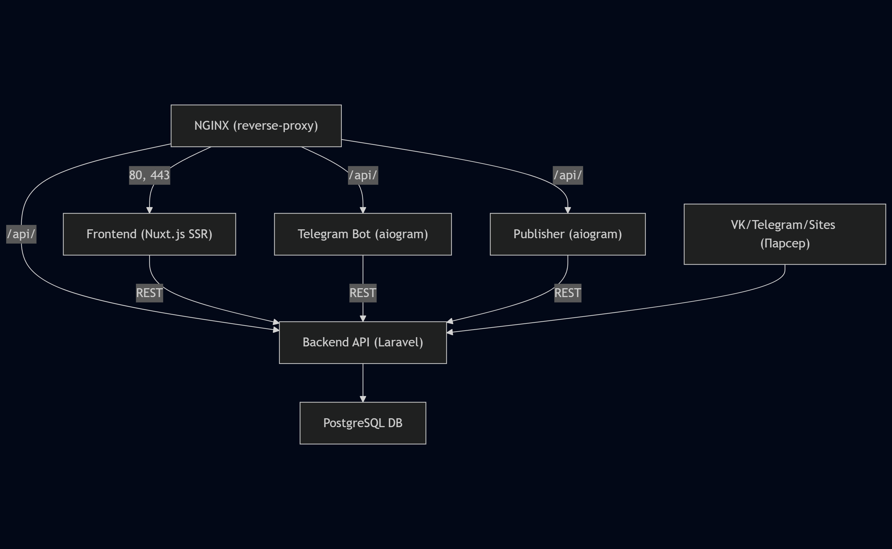

#### ARCHITECTURE OVERVIEW

Проект **kudab.ru** — агрегатор событий и платформенный сервис с интеграцией Telegram, VK, внешних сайтов.  
Вся архитектура построена по принципу сервис-ориентированности с использованием Docker, CI/CD, единого API и универсальных связей.  
**Нет отдельного мобильного приложения:** только PWA (web) и Telegram-интерфейсы.

---

#### СХЕМА ВЗАИМОДЕЙСТВИЯ СЕРВИСОВ



```shell

```

---

#### СЕРВИСЫ И МИКРОСЕРВИСЫ

| Сервис           | Назначение                          | Стек / Особенности              |
| ---------------- | ----------------------------------- | ------------------------------- |
| kudab-infra      | meta-репозиторий (инфраструктура)   | Docker Compose, submodules      |
| kudab-api        | Backend API, бизнес-логика          | Laravel 12, PHP 8.2, PostgreSQL |
| kudab-frontend   | SSR фронтенд, клиентский UI (PWA)   | Nuxt.js 3, Vue, Tailwind, SSR   |
| kudab-bot        | Основной Telegram-бот               | Python 3, aiogram, httpx        |
| kudab-publisher  | Автоматическая публикация в каналы  | Python 3, aiogram, apscheduler  |
| kudab-nginx      | Reverse-proxy, раздача статики, SSL | NGINX 1.25 (alpine)             |
| kudab-db         | Хранилище данных                    | PostgreSQL 15+                  |
| (parser-service) | Парсинг VK, Telegram, сайтов        | Python, Node.js, cron           |

---

#### СТЕК ТЕХНОЛОГИЙ

- Backend: Laravel 12 (PHP 8.2), PostgreSQL 15+
- Frontend: Nuxt.js 3 (Vue 3, SSR, PWA), Tailwind CSS
- Bot & Publisher: Python 3.11, aiogram 3.x, httpx, apscheduler
- Infrastructure: Docker Compose, Alpine, NGINX, GitHub Actions (CI/CD)
- Мониторинг: (uptime-kuma, Grafana, Sentry — по мере внедрения)

---

#### ВЗАИМОДЕЙСТВИЕ И ПОТОК ДАННЫХ

1. Пользователь или бот делает запрос в Nginx.
2. Nginx проксирует запрос во Frontend (SSR/PWA) или API.
3. Frontend (Nuxt.js) общается с API для получения/отправки данных, SSR-рендерит страницы, поддерживает web-push и экспорт событий в календари.
4. API (Laravel) управляет бизнес-логикой, пишет/читает в базу, выдаёт REST-эндпоинты.
5. Бот и Publisher работают только через REST API, никак не ходят напрямую к БД.
6. Publisher планирует и выполняет рассылки по Telegram-каналам, взаимодействует с Telegram API.
7. Внешние источники (VK, сайты) интегрируются через парсер-сервис, его данные попадают в API.
8. Все действия пользователя фиксируются в БД через API (Single Source of Truth).

---

#### ПРИНЦИПЫ АРХИТЕКТУРЫ

- Сервисная структура: каждый компонент можно обновлять/заменять отдельно.
- Единая точка входа (Nginx).
- Вся логика доступа и данных — через API.
- Универсальные morphTo-связи в БД: parent_type/parent_id для расширяемых таблиц (attachments, interest_links и др.).
- Использование Docker для каждого сервиса — быстрый деплой и масштабирование.
- Конфигурирование через .env для каждого сервиса.
- Ориентация на автоматизацию и работу с минимальным количеством ручных действий.

---

#### ДОПОЛНИТЕЛЬНО

- docs/db-schema.md — подробная структура БД (markdown, пояснения)
- docs/database.dbml — визуальная ER-схема для dbdiagram.io
- docs/api.md — описание API (методы, сценарии, спецификация)
- docs/bot.md — сценарии Telegram-бота, команды, flow
- docs/publisher.md — логика автоматических рассылок
- docs/setup.md — инструкция по развёртыванию окружения

---

#### СХЕМА ВНУТРЕННЕЙ СВЯЗИ В БАЗЕ (упрощённо)

```
Table users { ... }
Table telegram_users { ... }
Table interests { ... }
Table events { ... }
Table context_posts { ... }
Table attachments { ... }
Table event_attendees { ... }
Table interest_links { ... }
```

---

#### СПЕЦИФИКА ПЛАТФОРМЫ

- Всё, что касается мобильных устройств — реализовано через адаптивный PWA и Telegram-бот (нет отдельного приложения).
- Экспорт событий в календари поддерживается во frontend и через бота.
- Система “Пойду”/“Избранное” — главный способ отклика на событие, “лайки” не используются.
- Добавление событий: автоматический парсинг и ручное добавление организаторами (после модерации).

---
